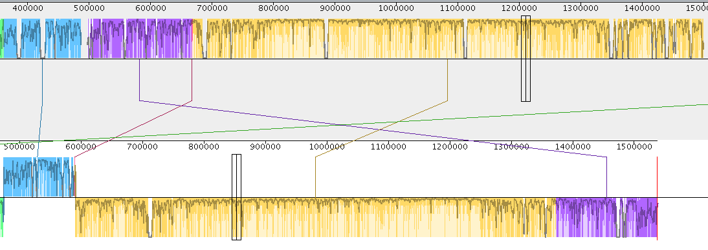

Progressive Mauve was used to align contigs containing HOX cluster in Illumina and PacBio assembly. The resolution of alignment allows to design PCR primers that would verify which of the orientations is the correct one.

See picture, basically 4 blocks of sequences are reordered, 2 of them are in inverser direction (yellow and purple).

The red block is very small (following purple block in illumina and blue in pacbio assembly). Exact coordinates are [in table](coordinates.tsv). Therefore I suggest to design primers as follows:

Reaction supporting IL orientation:

- `blue_F + purple_R` (purple R should not really be in purple, but rather in the gap between blue and purple block)
- `purple_F + red_R`
- `purple_F + yellow_IL_R` (>3k product)
- `red_F + yellow_IL_R`

Reactions supporting PB orientation:

- `blue_F + red_R`
- `blue_F + yellow_PB_R`
- `red_F + yellow_PB_R`
- `purple_F + yellow_IL_R` (smaller product)

